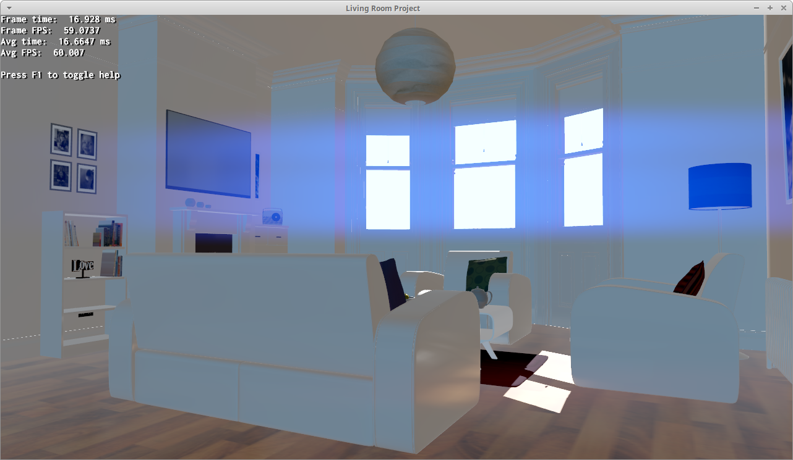
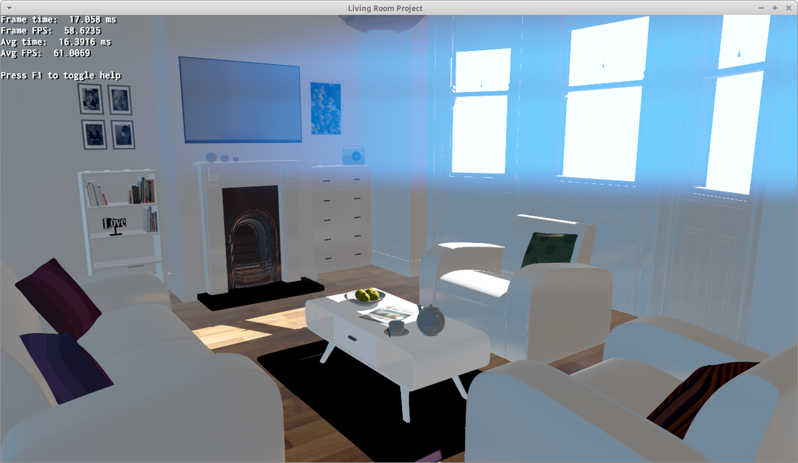
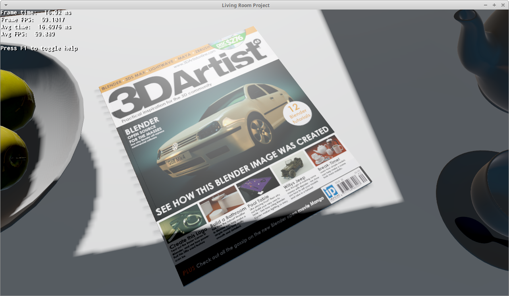
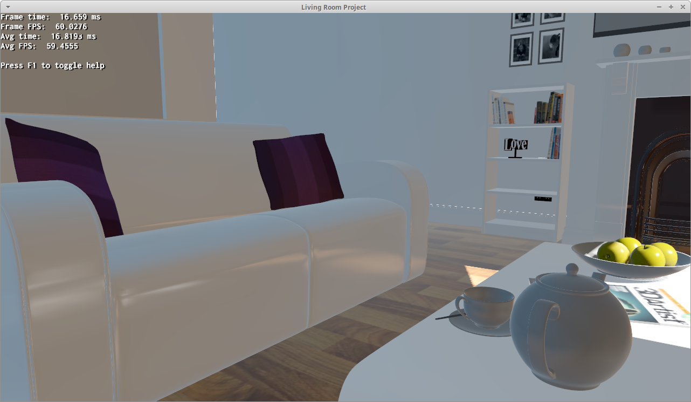
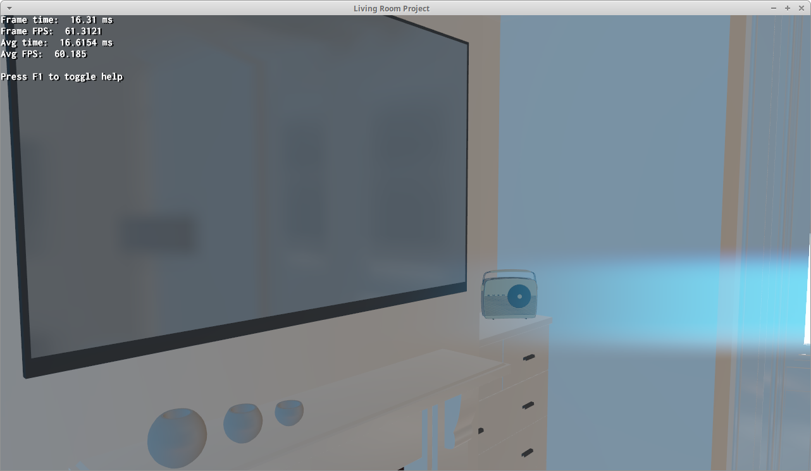
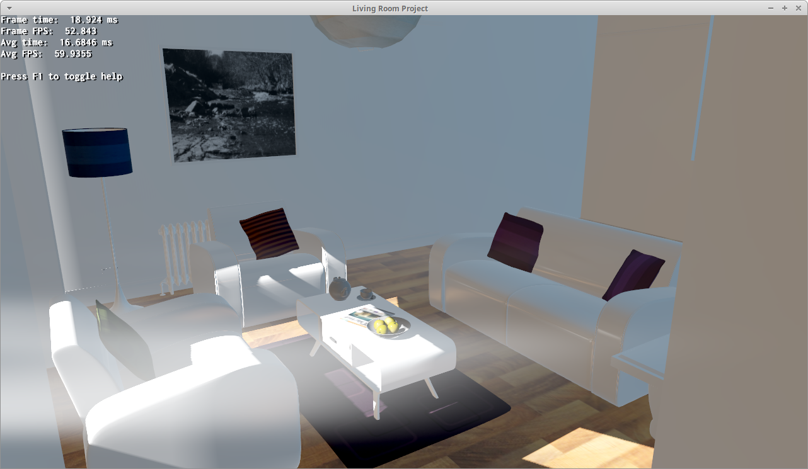
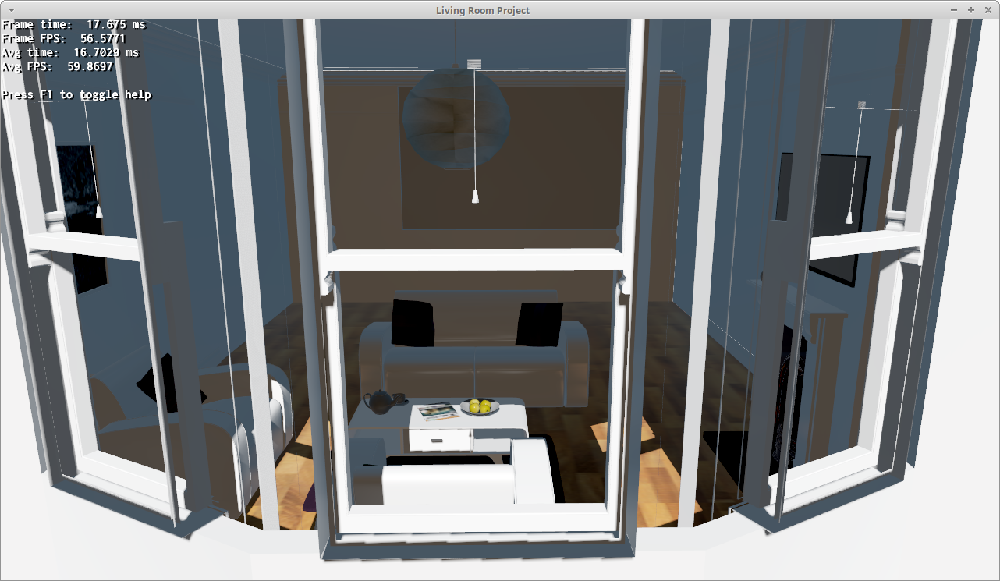

# Living Room Sample

This is a sample that showcases several features together
(HDR, instant radiosity, Parallax Corrected Cubemap) in the same application.

The scene has been obtained from:

[McGuire2017] Morgan McGuire, Computer Graphics Archive, July 2017
(https://casual-effects.com/data)

The purpose of this sample is to:

1. Show how to glue everything together
1. Have something more eye candy to show than the traditionally uninteresting
samples that come with Ogre
1. Test any regression

# How to compile

1. Download Ogre into Dependencies/Ogre:

		mkdir Dependencies
		cd Dependencies
		hg clone https://bitbucket.org/sinbad/ogre/ -r a7ba51494723 ./Ogre
		hg clone https://bitbucket.org/cabalistic/ogredeps

1. Build Ogre dependencies (ogredeps) & Ogre [as described in the instructions](https://ogrecave.github.io/ogre/api/2.1/SettingUpOgre.html)
	* On Windows the CMake build folder must be at Dependencies/Ogre/build
	* On Linux the CMake build folder must be at Dependencies/Ogre/build/Debug or Dependencies/Ogre/build/Release depending on what build you perform
1. Run CMake, make the build folder be at build.
1. Compile it with the generated project file.

# Screenshots

# Editing the scene

The original files are in the External folder. Open External/living_room.blend
in Blender to edit it. Blender 2.78c and
[DERGO](https://bitbucket.org/dark_sylinc/dergo-blender) were used to create and
export the scene.
